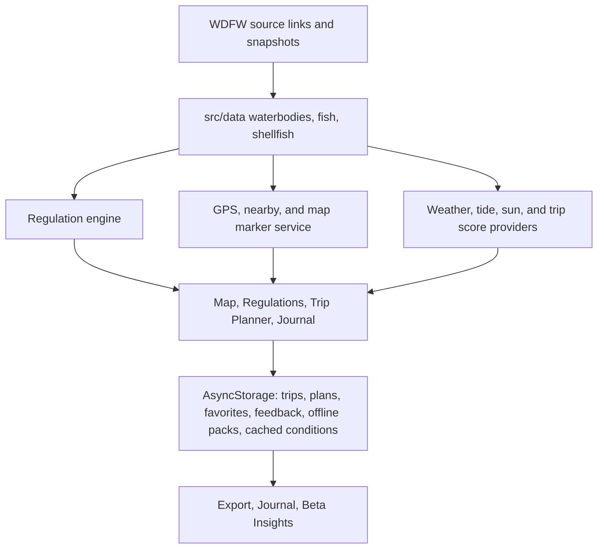
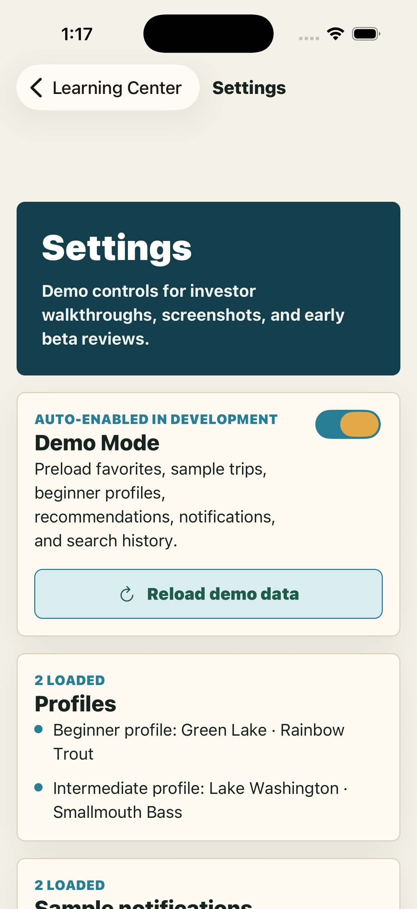
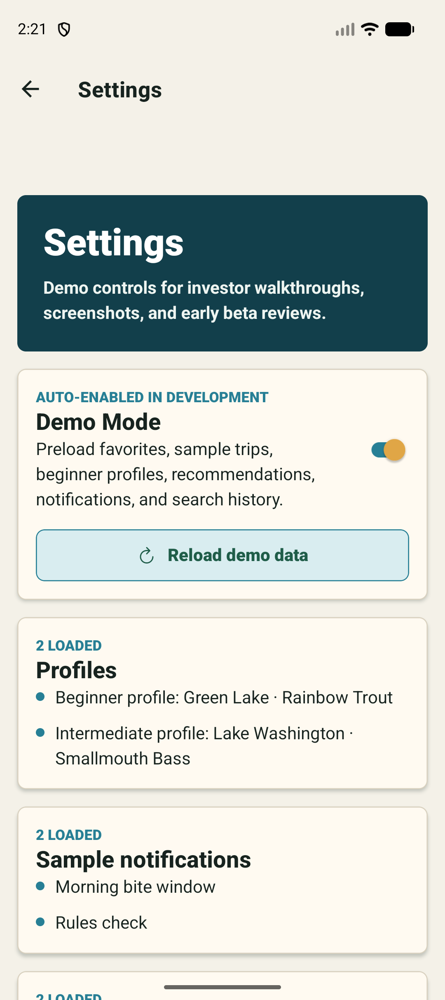

# Unskunked


Unskunked is a local-first Expo React Native fishing assistant for beginner anglers. It helps users choose a waterbody, pick a target species, build a simple rig, plan a trip, learn the basics, and log what worked.

The current app is a polished Phase 9 Washington-focused beta with WDFW-sourced metadata scaffolding, a native GPS map, clamming/crabbing readiness, current-regulation summaries, offline weather/tide/sun scoring, local storage, and native share/export flows.

## Feature Overview

- Demo Mode that preloads favorite waters, fish, rigs, knots, realistic trip history, profiles, notifications, recommendations, and search history
- First-launch beta onboarding with region, experience, fishing style, favorite fish, favorite waterbodies, and a final Start Fishing Smarter flow
- GPS-aware nearby fishing with permission handling, denied/unavailable fallbacks, manual city locations, distance sorting, and water-type filters
- Native `react-native-maps` GPS map with fishing, clamming, crabbing, beach, pier, launch, and waterbody markers plus chip-based fallback results
- Washington shellfish support for clamming and crabbing with species, beach/pier locations, tide reminders, legal warnings, gear checklists, and official WDFW source links
- Expanded Washington mock waterbody dataset with 25 locations, counties, coordinates, access notes, parking notes, seasons, rigs, bait, and regulation warnings
- WDFW-style waterbody metadata including `waterbodyId`, source, `lastUpdated`, regulation references, stocking examples, and launch/access fields
- Current regulation engine with open/restricted/closed status, season, catch limits, bait restrictions, emergency-rule reminders, and badge summaries
- Smart fishing conditions score using weather, wind, temperature, pressure, cloud cover, rain, UV, waterbody type, season, time windows, experience, and target species
- Offline weather, hourly, tomorrow, 7-day, sunrise/sunset, golden hour, bite windows, and saltwater tide support
- Weather/tide provider abstraction with mock provider, live-provider placeholder, and local cached conditions snapshots
- Smart trip score by activity type using weather, wind, water type, tide movement, distance, experience, season, and species/activity target
- Offline download packs for Washington, counties, and species
- Expanded Washington fish coverage including trout, bass, panfish, walleye, catfish, carp, salmon, steelhead, sturgeon placeholder, and saltwater species
- Real-data-ready regulation architecture with provider interfaces, Washington mock provider, emergency-rule placeholders, waterbody rules, species rules, season checks, limits, and gear warnings
- Official WDFW verification links for regulations, emergency rules, licenses, Fish Washington, freshwater rules, marine areas, and shellfish/seaweed resources
- Personalization engine using onboarding profile, favorites, trip history, season, successful bait, and successful rigs
- Professional Home dashboard with today’s recommendation, continue-trip prompt, favorite lakes, quick actions, beginner tips, recent catches, weather placeholder, and regulation reminder
- Interactive mock map with search suggestions, filters, markers, recently viewed waterbodies, favorites, and a polished selected-water detail card
- Plan My Fishing Trip generator for fishing, clamming, and crabbing with nearby mode, legal summary, gear checklist, bait checklist, rig/activity setup, knot or gear note, smart timing, safety reminder, backup plan, YouTube links, saved plans, and Start Trip draft logs
- Fish database and detail pages with season, weather, time of day, bait, lures, gear, rigs, knots, mistakes, habitat, regulation warnings, and YouTube learning links
- Guided Rig Builder with a confidence estimate, bait recommendation, knot recommendation, and labeled SVG rig diagrams
- Trip Log with saved plans, local history, skunked versus unskunked stats, most successful bait, and most successful location
- Fishing Stats screen with best locations, bait, rigs, time of day, species, monthly activity, and personal records
- Favorites for fish, waterbodies, rigs, and knots
- Ask Unskunked rule-based local assistant
- Learning Center with beginner, species, rod, reel, line, hook, lure, safety, etiquette, and Washington basics articles
- Region selection for Washington, Oregon, Idaho, and California, with non-Washington regions clearly marked demo-only
- Global search across fish, waterbodies, rigs, knots, learning articles, and trip logs
- Feedback system for bug reports, feature requests, confusing regulations, wrong recommendations, wrong waterbody info, and general notes
- Native share-sheet support for trip plans, fish tips, waterbody recommendations, trip log results, feedback, and beta data export
- About Unskunked page with mission, disclaimers, current region support, roadmap, and contact/feedback entry point
- Local-only Beta Insights for viewed fish, viewed waterbodies, rig use, planner choices, searches, and feedback categories
- Screenshot automation for iOS and Android
- PNG app icon, adaptive icon, splash image, store graphic placeholder, and EAS build profiles for development, preview, and production

## Architecture

- `app/`: Expo Router screens and routes
- `app/(tabs)/`: primary tab experience
- `src/components/`: reusable UI system
- `src/data/`: mock fish, waterbody, rig, learning, and region data
- `src/hooks/`: reusable hooks such as favorites
- `src/services/`: regulation providers, personalization engine, and trip analytics
- `src/services/location.ts`: distance calculation, manual fallback locations, Expo location permission flow, and nearby sorting
- `src/services/regulationEngine.ts`: current regulation badges and WDFW-ready summaries
- `src/services/fishingConditions.ts`: weather, sun, tide, and trip score helpers
- `src/services/conditionProviders.ts`: mock/live weather and tide provider contract plus offline condition cache helper
- `src/services/mapMarkers.ts`: unified fishing, clamming, and crabbing marker/search model
- `src/services/wdfwImportPipeline.ts`: WDFW snapshot manifest validation and import readiness reporting
- `src/services/offlineDownloads.ts`: offline pack definitions
- `src/utils/`: storage abstraction, local store, recommendations, search, and YouTube helpers
- `scripts/`: automation utilities
- `docs/`: QA checklist, beta tester guide, and developer handoff
- `screenshots/`: generated iOS and Android screenshots
- `data/snapshots/`: immutable WDFW source manifests and future source snapshots

The app is intentionally local-first. Future real-data integrations should replace or augment provider classes in `src/services/*` while preserving the current screen contracts.

## Architecture Diagram



## Data Flow

Unskunked currently ships WDFW-sourced metadata scaffolding as local fixtures and snapshot manifests. Screens read local data and services first, then link users out to official WDFW pages for verification. No backend is required, and no location or analytics data is sent anywhere.

## Offline Support

Core waterbodies, fish, shellfish locations, regulation summaries, trip logs, trip plans, favorites, feedback, cached conditions, and offline pack selections are local. Offline packs currently mark local datasets for offline use; future phases should add map tiles and official WDFW import bundles.

## GPS Support

Location is optional. If permission is denied or unavailable, Unskunked falls back to manual Washington locations and continues to sort nearby waterbodies and shellfish locations locally.

## Shellfish Support

Phase 9 adds clamming and crabbing as first-class activity types. The app includes local Washington shellfish species, beach/pier locations, tide-aware trip scoring, gear lists, WDFW shellfish/emergency/license links, and journal/planner support.

## Regulation Data Path

Phase 5 adds the production-facing shape for regulation data:

- `RegulationProvider`: shared provider contract
- `WashingtonRegulationProvider`: mocked Washington rules and official WDFW source links
- `MockRegulationProvider`: placeholder provider for demo-only states
- `RegulationService`: public query surface for statewide, species, and waterbody rules
- `EmergencyRuleService`: placeholder for emergency-rule ingestion
- `WaterbodyRuleService`: focused helper for waterbody warning messages

Current rule data is still mock/local. Official WDFW integration should add source timestamps, import validation, and waterbody/species/date matching before any legal claims are made.

## Beta Testing

Useful docs:

- [QA Checklist](docs/QA_CHECKLIST.md)
- [Beta Tester Guide](docs/BETA_TESTER_GUIDE.md)
- [Developer Handoff](docs/DEVELOPER_HANDOFF.md)
- [Beta Distribution](docs/BETA_DISTRIBUTION.md)
- [Data Pipeline](docs/DATA_PIPELINE.md)
- [Provider Setup](docs/PROVIDER_SETUP.md)

Beta testers should focus on onboarding, location permission/fallback behavior, nearby water sorting, planning a trip, checking disclaimers/source links, saving feedback, exporting JSON, and sharing plans/results through the native share sheet.

## Development Setup

Requirements:

- Node.js 22+
- npm
- Expo Go, iOS Simulator, or Android Emulator

Install dependencies:

```bash
npm install
```

Start Expo:

```bash
npm start
```

Run iOS:

```bash
npm run ios
```

Run Android:

```bash
npm run android
```

## Testing

```bash
npm test
npm run typecheck
```

Compile bundle checks:

```bash
npx expo export --platform ios --output-dir /private/tmp/unskunked-export-ios
npx expo export --platform android --output-dir /private/tmp/unskunked-export-android
```

## Screenshot Automation

Create screenshots after the app is running on a simulator/emulator.

For standalone or development builds that register `unskunked://`:

```bash
npm run screenshots:ios
npm run screenshots:android
```

For Expo Go, pass the dev-server URL printed by Expo:

```bash
EXPO_URL=exp://YOUR_LOCAL_IP:8081 npm run screenshots:ios
EXPO_URL=exp://YOUR_LOCAL_IP:8081 npm run screenshots:android
```

The script navigates to each route and captures:

- Home with nearby recommendation
- Nearby Waters
- Live GPS Map
- Waterbody Detail
- Shellfish Map
- Fish Detail
- Regulations
- Weather
- Tides
- Nearby Trip Planner
- Clamming Planner
- Crabbing Planner
- GPS Permission
- Offline Mode
- Search
- Fishing Journal
- Beta Insights
- Settings
- About

## Screenshots

Screenshots are tracked so GitHub visitors see the app flow immediately. Regenerate them with the screenshot script after launching the latest build in iOS Simulator or Android Emulator.

### iOS





### Android





## App Limitations

- Regulation content is WDFW-source-linked local guidance and must still be verified with official agencies.
- Shellfish content is local planning guidance; users must verify WDFW shellfish rules, emergency rules, licenses, catch record card requirements, and health closures before harvesting.
- Washington has the most complete mock data; Oregon, Idaho, and California are placeholders.
- No backend, account sync, live weather API, live tides API, or live official regulation feed is connected yet.
- GPS is used only locally for distance sorting and native map display, with manual fallback locations.
- JSON export uses the native share sheet rather than a hosted account portal.

## Roadmap To Real Data

- Integrate official WDFW regulation datasets with source timestamps, waterbody IDs, emergency-rule status, shellfish seasons, stocking reports, and validation tests
- Add offline map tiles and richer GPS search
- Add waterbody detail pages with emergency rule alerts
- Replace mock weather/tide providers with free or official live providers plus cache invalidation
- Add account sync once local-only beta behavior is proven
- Add offline map/location packs
- Add real catch photo attachments
- Add fish ID by photo
- Add optional AI coach only after explicit user consent

## Contributing

Keep Unskunked Expo-compatible, TypeScript-clean, beginner-friendly, and local-first unless a feature explicitly requires integration. Regulation-related content must clearly distinguish mock guidance from official legal guidance.

## GitHub

Repository: `https://github.com/Aeh961/unskunked`

## Disclaimer

Unskunked is for planning and education only. Always verify current regulations with official fish and wildlife agencies before fishing or keeping fish.
