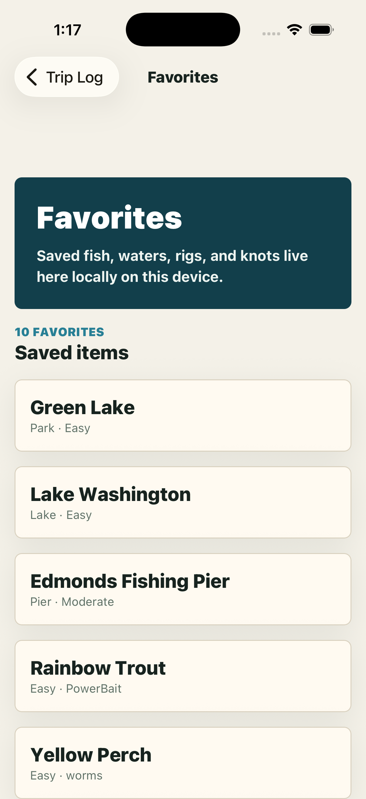
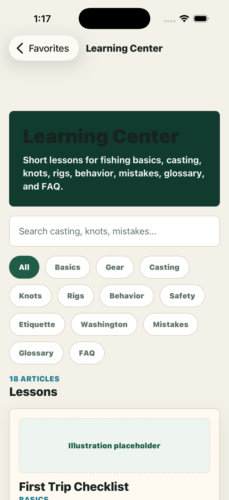
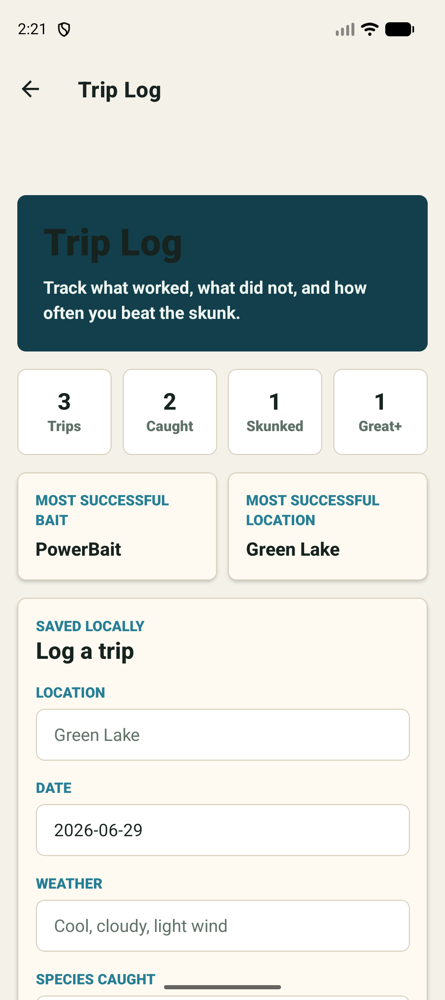
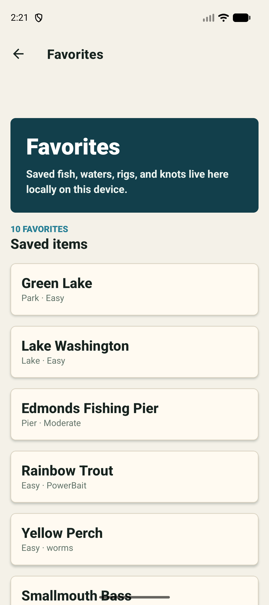
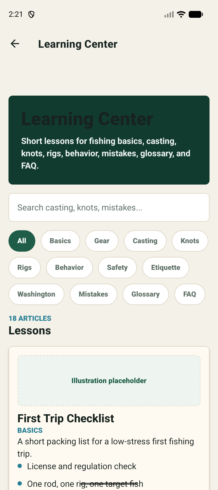

# Unskunked


Unskunked is a local-first Expo React Native fishing assistant for beginner anglers. It helps users choose a waterbody, pick a target species, build a simple rig, plan a trip, learn the basics, and log what worked.

The current app is a polished Phase 5 beta foundation using mock Washington fishing data, local storage, typed data services, and no paid APIs or backend.

## Feature Overview

- Demo Mode that preloads favorite waters, fish, rigs, knots, realistic trip history, profiles, notifications, recommendations, and search history
- Real-data-ready regulation architecture with provider interfaces, Washington mock provider, emergency-rule placeholders, waterbody rules, species rules, season checks, limits, and gear warnings
- Official WDFW verification links for regulations, emergency rules, licenses, and Fish Washington resources
- Personalization engine using onboarding profile, favorites, trip history, season, successful bait, and successful rigs
- Professional Home dashboard with today’s recommendation, continue-trip prompt, favorite lakes, quick actions, beginner tips, recent catches, weather placeholder, and regulation reminder
- Interactive mock map with search suggestions, filters, markers, recently viewed waterbodies, favorites, and a polished selected-water detail card
- Plan My Fishing Trip generator with legal summary, gear checklist, bait checklist, rig setup, knot, best time, safety reminder, backup plan, YouTube links, saved plans, and Start Trip draft logs
- Fish database and detail pages with season, weather, time of day, bait, lures, gear, rigs, knots, mistakes, habitat, regulation warnings, and YouTube learning links
- Guided Rig Builder with a confidence estimate, bait recommendation, knot recommendation, and labeled SVG rig diagrams
- Trip Log with saved plans, local history, skunked versus unskunked stats, most successful bait, and most successful location
- Fishing Stats screen with best locations, bait, rigs, time of day, species, monthly activity, and personal records
- Favorites for fish, waterbodies, rigs, and knots
- Ask Unskunked rule-based local assistant
- Learning Center with beginner, species, rod, reel, line, hook, lure, safety, etiquette, and Washington basics articles
- Region selection for Washington, Oregon, Idaho, and California, with non-Washington regions clearly marked demo-only
- Global search across fish, waterbodies, rigs, knots, learning articles, and trip logs
- Screenshot automation for iOS and Android

## Architecture

- `app/`: Expo Router screens and routes
- `app/(tabs)/`: primary tab experience
- `src/components/`: reusable UI system
- `src/data/`: mock fish, waterbody, rig, learning, and region data
- `src/hooks/`: reusable hooks such as favorites
- `src/services/`: regulation providers, personalization engine, and trip analytics
- `src/utils/`: storage abstraction, local store, recommendations, search, and YouTube helpers
- `scripts/`: automation utilities
- `screenshots/`: generated iOS and Android screenshots

The app is intentionally local-first. Future real-data integrations should replace or augment provider classes in `src/services/*` while preserving the current screen contracts.

## Regulation Data Path

Phase 5 adds the production-facing shape for regulation data:

- `RegulationProvider`: shared provider contract
- `WashingtonRegulationProvider`: mocked Washington rules and official WDFW source links
- `MockRegulationProvider`: placeholder provider for demo-only states
- `RegulationService`: public query surface for statewide, species, and waterbody rules
- `EmergencyRuleService`: placeholder for emergency-rule ingestion
- `WaterbodyRuleService`: focused helper for waterbody warning messages

Current rule data is still mock/local. Official WDFW integration should add source timestamps, import validation, and waterbody/species/date matching before any legal claims are made.

## Development Setup

Requirements:

- Node.js 22+
- npm
- Expo Go, iOS Simulator, or Android Emulator

Install dependencies:

```bash
npm install
```

Start Expo:

```bash
npm start
```

Run iOS:

```bash
npm run ios
```

Run Android:

```bash
npm run android
```

## Testing

```bash
npm test
npm run typecheck
```

Compile bundle checks:

```bash
npx expo export --platform ios --output-dir /private/tmp/unskunked-export-ios
npx expo export --platform android --output-dir /private/tmp/unskunked-export-android
```

## Screenshot Automation

Create screenshots after the app is running on a simulator/emulator.

For standalone or development builds that register `unskunked://`:

```bash
npm run screenshots:ios
npm run screenshots:android
```

For Expo Go, pass the dev-server URL printed by Expo:

```bash
EXPO_URL=exp://YOUR_LOCAL_IP:8081 npm run screenshots:ios
EXPO_URL=exp://YOUR_LOCAL_IP:8081 npm run screenshots:android
```

The script navigates to each route and captures:

- Onboarding
- Home
- Map
- Waterbody Detail
- Fish Detail
- Rig Builder
- Trip Planner
- Trip Log
- Fishing Stats
- Favorites
- Learning Center
- Settings

## Screenshots

### iOS






### Android







## Roadmap To Real Data

- Integrate official WDFW regulation datasets with source timestamps, waterbody IDs, emergency-rule status, and validation tests
- Add real map provider and GPS search
- Add waterbody detail pages with emergency rule alerts
- Add weather, tide, and pressure context
- Add account sync once local-only beta behavior is proven
- Add offline map/location packs
- Add real catch photo attachments
- Add fish ID by photo
- Add optional AI coach only after explicit user consent

## Contributing

Keep Unskunked Expo-compatible, TypeScript-clean, beginner-friendly, and local-first unless a feature explicitly requires integration. Regulation-related content must clearly distinguish mock guidance from official legal guidance.

## GitHub

Repository: `https://github.com/Aeh961/unskunked`

## Disclaimer

Unskunked is for planning and education only. Always verify current regulations with official fish and wildlife agencies before fishing or keeping fish.
