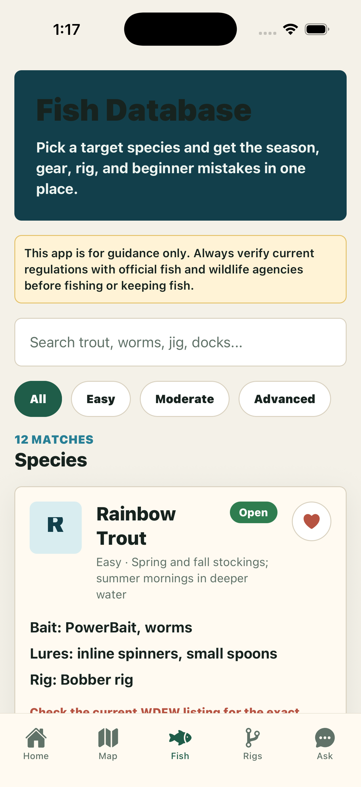
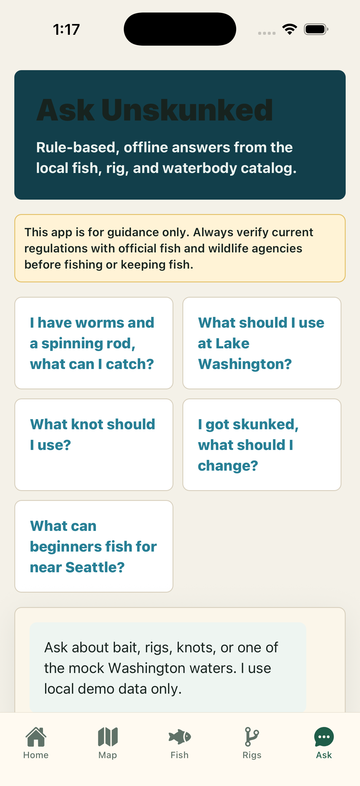
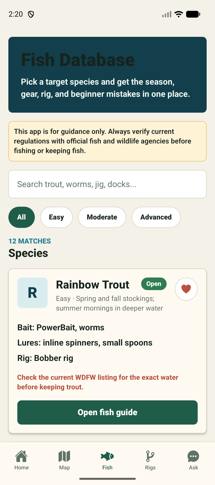
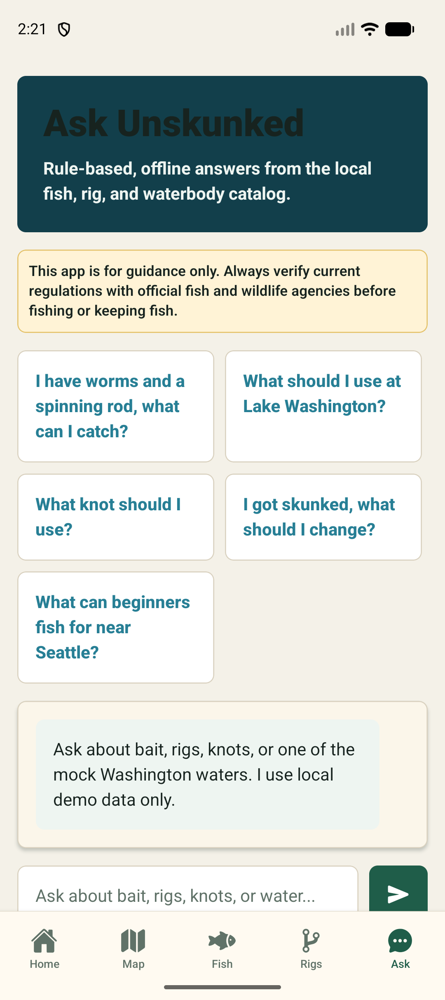

# Unskunked


Unskunked is a local-first Expo React Native fishing assistant for beginner anglers. It helps users choose a waterbody, pick a target species, build a simple rig, plan a trip, learn the basics, and log what worked.

The current app is a polished V2/Phase 4 demo using mock Washington fishing data, local storage, and no paid APIs or backend.

## Feature Overview

- Demo Mode that preloads favorite waters, fish, rigs, knots, realistic trip history, profiles, notifications, recommendations, and search history
- Professional Home dashboard with today’s recommendation, continue-trip prompt, favorite lakes, quick actions, beginner tips, recent catches, weather placeholder, and regulation reminder
- Interactive mock map with search suggestions, filters, markers, recently viewed waterbodies, favorites, and a polished selected-water detail card
- Plan My Fishing Trip generator with month, waterbody, access, experience, and target fish inputs
- Fish database and detail pages with season, weather, time of day, bait, lures, gear, rigs, knots, mistakes, habitat, regulation warnings, and YouTube learning links
- Guided Rig Builder with a confidence estimate, bait recommendation, knot recommendation, and labeled SVG rig diagrams
- Trip Log with local history, skunked versus unskunked stats, most successful bait, and most successful location
- Favorites for fish, waterbodies, rigs, and knots
- Ask Unskunked rule-based local assistant
- Learning Center with beginner, species, rod, reel, line, hook, lure, safety, etiquette, and Washington basics articles
- Screenshot automation for iOS and Android

## Architecture

- `app/`: Expo Router screens and routes
- `app/(tabs)/`: primary tab experience
- `src/components/`: reusable UI system
- `src/data/`: mock fish, waterbody, rig, and learning data
- `src/hooks/`: reusable hooks such as favorites
- `src/utils/`: local storage, recommendations, search, and YouTube helpers
- `scripts/`: automation utilities
- `screenshots/`: generated iOS and Android screenshots

The app is intentionally local-first. Future real-data integrations should replace or augment `src/data/*` through typed service adapters while preserving the current screen contracts.

## Development Setup

Requirements:

- Node.js 22+
- npm
- Expo Go, iOS Simulator, or Android Emulator

Install dependencies:

```bash
npm install
```

Start Expo:

```bash
npm start
```

Run iOS:

```bash
npm run ios
```

Run Android:

```bash
npm run android
```

## Testing

```bash
npm test
npm run typecheck
```

Compile bundle checks:

```bash
npx expo export --platform ios --output-dir /private/tmp/unskunked-export-ios
npx expo export --platform android --output-dir /private/tmp/unskunked-export-android
```

## Screenshot Automation

Create screenshots after the app is running on a simulator/emulator.

For standalone or development builds that register `unskunked://`:

```bash
npm run screenshots:ios
npm run screenshots:android
```

For Expo Go, pass the dev-server URL printed by Expo:

```bash
EXPO_URL=exp://YOUR_LOCAL_IP:8081 npm run screenshots:ios
EXPO_URL=exp://YOUR_LOCAL_IP:8081 npm run screenshots:android
```

The script navigates to each route and captures:

- Home
- Map
- Waterbody Detail
- Fish List
- Fish Detail
- Rig Builder
- Rig Diagram
- Ask Unskunked
- Trip Log
- Favorites
- Learning Center
- Settings

## Screenshots

### iOS








### Android








## Roadmap To Real Data

- Integrate official WDFW regulation datasets with source timestamps
- Add real map provider and GPS search
- Add waterbody detail pages with emergency rule alerts
- Add weather, tide, and pressure context
- Add offline map/location packs
- Add real catch photo attachments
- Add fish ID by photo
- Add optional AI coach only after explicit user consent

## Contributing

Keep Unskunked Expo-compatible, TypeScript-clean, beginner-friendly, and local-first unless a feature explicitly requires integration. Regulation-related content must clearly distinguish mock guidance from official legal guidance.

## GitHub

Repository: `https://github.com/Aeh961/unskunked`

## Disclaimer

Unskunked is for planning and education only. Always verify current regulations with official fish and wildlife agencies before fishing or keeping fish.
