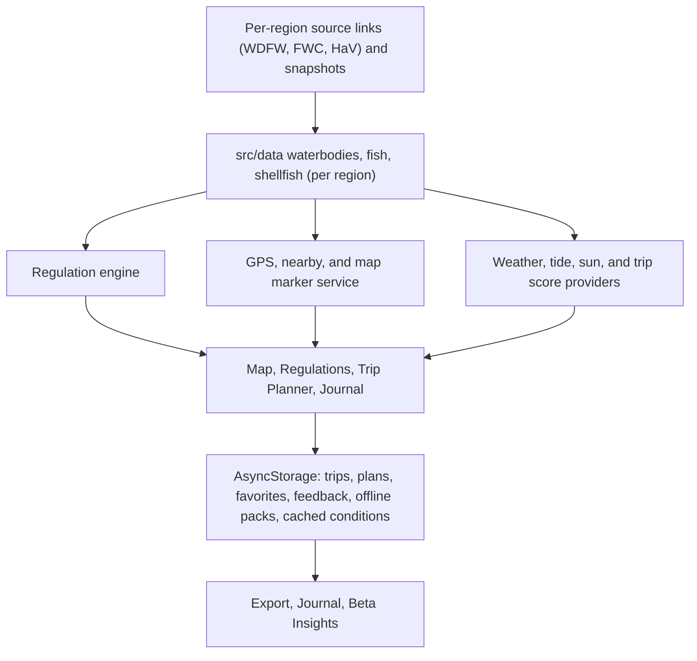
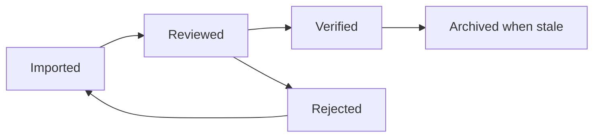
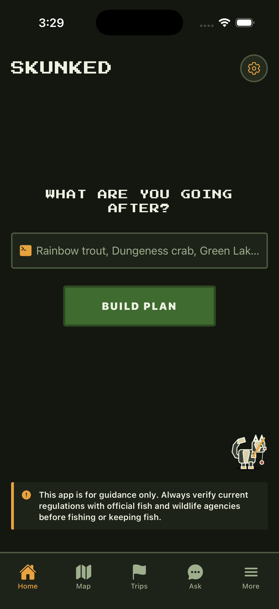
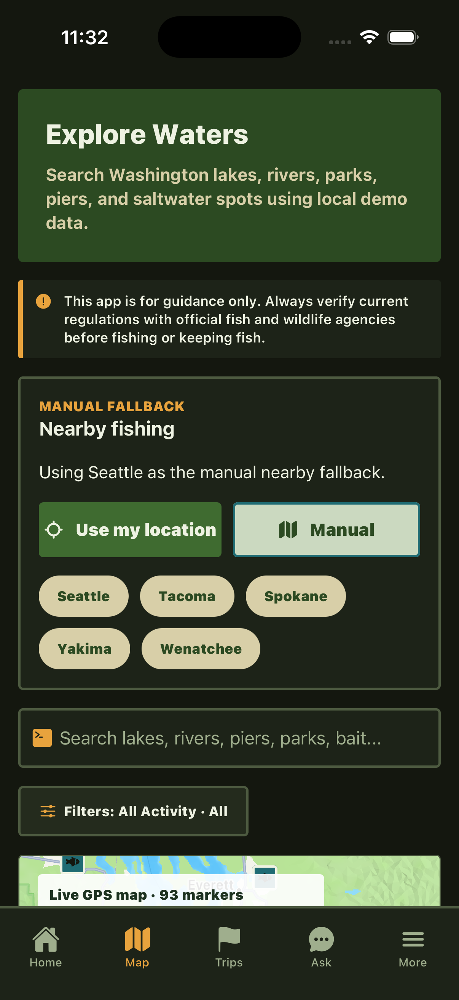
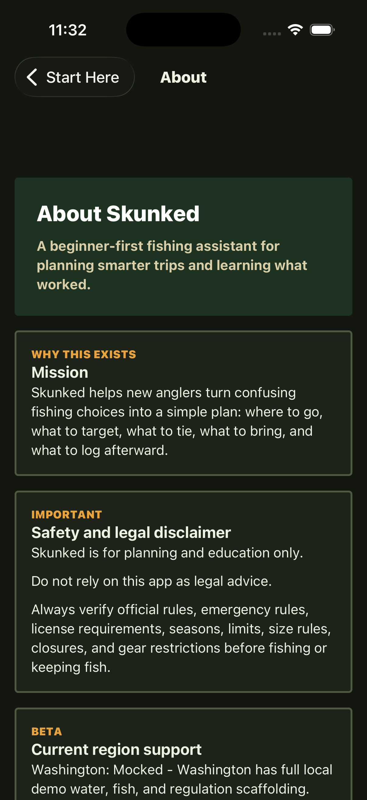

# Skunked


Skunked is a local-first Expo React Native fishing assistant for beginner anglers. It helps users choose a waterbody, pick a target species, build a simple rig, plan a trip, learn the basics, and log what worked.

The current app is a polished public-beta candidate covering three regions - Washington, Florida, and Ronneby, Sweden - behind a generalized region/provider architecture, with a native GPS map, clamming/crabbing readiness (Washington), source confidence badges, data freshness warnings, current-regulation summaries, offline weather/tide/sun scoring, local storage, and native share/export flows.

The interaction model is text-first: instead of tapping through preselected suggestion cards, users type what they're fishing, clamming, or crabbing for and get typed autocomplete plus a local (fully offline, no LLM/network dependency) natural-language parser that extracts activity/species/location/gear/date and asks one short follow-up question at a time. The visual identity is an original 1990s-arcade / military-field-terminal theme (dark charcoal-olive palette, a pixel-inspired display font reserved for short headings only, blockier bordered panels, an original pixel-art skunk-with-fishing-rod mascot used sparingly for empty/success/loading states) - not a reproduction of any existing game's assets or characters.

## Data Sources & Coverage

Waterbody data is imported through a re-runnable pipeline (`scripts/data-pipeline/`) that validates and dedupes real records from public government sources, rather than being hand-invented:

| Region | Waterbodies | Sources | Verification |
| --- | --- | --- | --- |
| Washington | 335 | WDFW "Water Access Sites" and "Shore Fishing Sites" live ArcGIS feeds (251 imported), plus 84 hand-curated launch/park entries | All imported records carry a real `sourceUrl`; hand-curated entries predate verification tracking |
| Florida | 138 | FWC's public "Florida Boat Ramp Inventory" ArcGIS feed (89 records) and 14 individually-sourced public piers, plus 35 hand-curated entries | 99 imported, 4 needs-verification (piers with uncertain post-storm status or approximate coordinates) |
| Ronneby, Sweden | 11 | Ronneby kommun's official fishing pages and Havs- och vattenmyndigheten (HaV), cross-checked against Wikipedia infobox coordinates | 2 imported, 9 needs-verification (small dataset, no bulk GIS feed available at this scale) |

Coverage is not claimed to be complete - it reflects what has actually been sourced and imported so far (see the in-app Data Sources screen for a live breakdown, and the comments in `scripts/data-pipeline/generate.mjs` for how to re-run or extend it: `node scripts/data-pipeline/generate.mjs <washington|florida> [--input path.json]`). Known gaps: Washington has no site in Garfield County (WDFW has none listed in either feed used); Florida pier coverage leans Atlantic/Panhandle, thinner on the Gulf Coast south of Tampa and in the Keys; Ronneby's small size means it's covered by hand-sourced entries rather than a bulk import.

## Feature Overview

- Demo Mode (off by default, isolated under a collapsed "Developer / Demo Mode" section in Settings) that preloads favorite waters, fish, rigs, knots, realistic trip history, profiles, notifications, recommendations, and search history for screenshots/walkthroughs, and prunes those records back out when turned off
- First-launch beta onboarding with region, experience, fishing style, favorite fish, favorite waterbodies, and a final Start Fishing Smarter flow
- GPS-aware nearby fishing with permission handling, denied/unavailable fallbacks, manual city locations, distance sorting, and water-type filters
- Native `react-native-maps` GPS map with a top-of-screen region selector (Washington/Florida/Ronneby), fishing/clamming/crabbing/beach/pier/launch markers, and a single row-based result list (`WaterbodyListRow`, `FlatList`-backed) that both the map and the fallback list read from - no separate "nearby" section, and a web/render-failure fallback that degrades to the same list
- Data Sources center showing providers, source organizations, last imported date, last verified date, source type, confidence, and update frequency
- Confidence badges for Official Source, Verified, Imported, Community Verified, Needs Verification, Demo Data, and Unknown
- Data freshness warnings for recommendations, regulations, weather/tide fallbacks, and source snapshots
- Verification workflow states for future admin tooling: imported, reviewed, verified, rejected, and archived
- Import provider framework for future `fetch`, `validate`, `transform`, `cache`, and `metadata` live sync
- Multi-region data architecture: `getWaterbodiesForRegion()`/`getSpeciesForRegion()` accessors plus per-region `OfficialLinkProvider` and `RegulationProvider` implementations for Washington, Florida, and Ronneby (Sweden), with Oregon, Idaho, California, and British Columbia as explicit placeholders - see [Architecture](docs/ARCHITECTURE.md)
- Washington shellfish support for clamming and crabbing with species, beach/pier locations, tide reminders, legal warnings, gear checklists, and official WDFW source links
- Washington waterbody dataset with 335 locations; Florida with 138; Ronneby with 11 - all with counties/regions, coordinates, access notes, parking notes, seasons, rigs, bait, and regulation warnings (see Data Sources & Coverage above)
- Region-appropriate waterbody metadata including `waterbodyId`, source, `lastUpdated`, regulation references, stocking examples (Washington), and launch/access fields
- Current regulation engine with open/restricted/closed status, season, catch limits, bait restrictions, emergency-rule reminders, and badge summaries, region-aware via each waterbody's `regionId`
- Smart fishing conditions score using weather, wind, temperature, pressure, cloud cover, rain, UV, waterbody type, season, time windows, experience, and target species
- Offline weather, hourly, tomorrow, 7-day, sunrise/sunset, golden hour, bite windows, and saltwater tide support
- Weather/tide provider abstraction with mock provider, live-provider placeholder, and local cached conditions snapshots
- Smart trip score by activity type using weather, wind, water type, tide movement, distance, experience, season, and species/activity target
- Offline download packs for the selected region, its counties, and species
- Washington fish coverage including trout, bass, panfish, walleye, catfish, carp, salmon, steelhead, sturgeon, tiger muskie, burbot, lake trout, and saltwater species; Florida coverage including largemouth bass, panfish, redfish, snook, tarpon, spotted seatrout, and mangrove snapper; Ronneby coverage including pike, perch, zander, sea trout, Baltic cod, and herring
- Real-data-ready regulation architecture with provider interfaces, one mock provider per complete region (Washington, Florida, Ronneby), emergency-rule placeholders, waterbody rules, species rules, season checks, limits, and gear warnings
- Official verification links per region: WDFW (Washington), FWC (Florida), and Havs- och vattenmyndigheten/HaV (Ronneby) for regulations, emergency rules, licenses, and marine/freshwater resources
- Personalization engine using onboarding profile, favorites, trip history, season, successful bait, and successful rigs
- Professional Home dashboard with today’s recommendation, continue-trip prompt, favorite lakes, quick actions, beginner tips, recent catches, weather placeholder, and regulation reminder
- Interactive mock map with search suggestions, filters, markers, recently viewed waterbodies, favorites, and a polished selected-water detail card
- Plan My Fishing Trip generator for fishing, clamming, and crabbing with nearby mode, legal summary, gear checklist, bait checklist, rig/activity setup, knot or gear note, smart timing, safety reminder, backup plan, YouTube links, saved plans, and Start Trip draft logs
- Fish database and detail pages with season, weather, time of day, bait, lures, gear, rigs, knots, mistakes, habitat, regulation warnings, and YouTube learning links
- Guided Rig Builder with a confidence estimate, bait recommendation, knot recommendation, and labeled SVG rig diagrams
- Trip Log with saved plans, local history, skunked versus unskunked stats, most successful bait, and most successful location
- Fishing Stats screen with best locations, bait, rigs, time of day, species, monthly activity, and personal records
- Favorites for fish, waterbodies, rigs, and knots
- Ask Skunked rule-based local assistant
- Learning Center with beginner, species, rod, reel, line, hook, lure, safety, etiquette, and Washington basics articles
- Region selection for Washington, Florida, Ronneby (Sweden), Oregon, Idaho, and California, with Oregon/Idaho/California clearly marked demo-only placeholders
- Global search across fish, waterbodies, rigs, knots, learning articles, and trip logs
- Feedback system for bug reports, feature requests, confusing regulations, wrong recommendations, wrong waterbody info, and general notes
- Native share-sheet support for trip plans, fish tips, waterbody recommendations, trip log results, feedback, and beta data export
- About Skunked page with mission, disclaimers, current region support, roadmap, and contact/feedback entry point
- Local-only Beta Insights for viewed fish, viewed waterbodies, rig use, planner choices, searches, and feedback categories
- Screenshot automation for iOS and Android
- Original skunk-and-fishing-rod logo mark (`assets/skunked-mark.svg`) rasterized via `scripts/generate-icons.mjs` into the app icon, adaptive icon, splash image, favicon, and store graphic, plus EAS build profiles for development, preview, and production

## Architecture

- `app/`: Expo Router screens and routes
- `app/(tabs)/`: five-tab experience - Home, Map, Trips, Ask, More
- `app/species.tsx`, `app/rigs.tsx`, `app/learn.tsx`, etc.: secondary screens reachable from the More tab
- `src/components/`: reusable UI system, including the arcade-theme text-first primitives (`SearchInput`, `Autocomplete`, `MissionCard`, `PixelMarker`, `Scanlines`)
- `src/data/`: mock fish, waterbody, rig, learning, and region data - `src/data/waterbodies/` and `src/data/fish/` hold one file per region (Washington, Florida, Ronneby) behind `getWaterbodiesForRegion()`/`getSpeciesForRegion()` accessors; see [Architecture](docs/ARCHITECTURE.md) for the full multi-region data model
- `src/hooks/`: reusable hooks such as favorites and reduced-motion detection
- `src/utils/autocomplete.ts`: ranked cross-catalog autocomplete for the typed search inputs
- `src/utils/tripParser.ts`: local rule-based natural-language trip parsing (no network/LLM dependency)
- `src/services/`: regulation providers, personalization engine, and trip analytics
- `src/services/location.ts`: distance calculation, manual fallback locations, Expo location permission flow, and nearby sorting
- `src/services/regulationEngine.ts`: current regulation badges and WDFW-ready summaries
- `src/services/fishingConditions.ts`: weather, sun, tide, and trip score helpers
- `src/services/conditionProviders.ts`: mock/live weather and tide provider contract plus offline condition cache helper
- `src/services/dataTrust.ts`: provider confidence, freshness, and verification workflow metadata
- `src/services/mapMarkers.ts`: unified fishing, clamming, and crabbing marker/search model
- `src/services/providerFramework.ts`: shared import provider interface for future live data
- `src/services/regionalProviders.ts`: plug-and-play regional provider registry
- `src/services/officialLinks.ts`: one `OfficialLinkProvider` per region (WDFW, FWC, HaV, and OR/ID/CA homepage placeholders)
- `src/services/recovery.ts`: helpful fallback copy for GPS, provider, weather, tide, offline, image, regulation, and import failures
- `src/services/wdfwImportPipeline.ts`: WDFW snapshot manifest validation and import readiness reporting
- `src/services/offlineDownloads.ts`: offline pack definitions
- `src/utils/`: storage abstraction, local store, recommendations, search, and YouTube helpers
- `scripts/`: automation utilities
- `docs/`: QA checklist, beta tester guide, and developer handoff
- `screenshots/`: generated iOS and Android screenshots
- `data/snapshots/`: immutable WDFW source manifests and future source snapshots

The app is intentionally local-first. Future real-data integrations should replace or augment provider classes in `src/services/*` while preserving the current screen contracts.

## Architecture Diagram


```mermaid
flowchart TD
  A["Per-region source links (WDFW, FWC, HaV) and snapshots"] --> B["src/data waterbodies, fish, shellfish (per region)"]
  B --> C["Regulation engine"]
  B --> D["GPS, nearby, and map marker service"]
  B --> E["Weather, tide, sun, and trip score providers"]
  C --> F["Map, Regulations, Trip Planner, Journal"]
  D --> F
  E --> F
  F --> G["AsyncStorage: trips, plans, favorites, feedback, offline packs, cached conditions"]
  G --> H["Export, Journal, Beta Insights"]
```

## Data Flow

Skunked currently ships local fixtures for three regions - WDFW-sourced metadata scaffolding for Washington, FWC-sourced scaffolding for Florida, and HaV-sourced scaffolding for Ronneby. Screens read local data and services first, then link users out to the selected region's official agency pages for verification. No backend is required, and no location or analytics data is sent anywhere.

## Verification Workflow

Phase 10 adds an admin-ready trust model for every future official import:


```mermaid
flowchart LR
  A["Imported"] --> B["Reviewed"]
  B --> C["Verified"]
  B --> D["Rejected"]
  C --> E["Archived when stale"]
  D --> A
```

Every recommendation should explain its source, confidence, freshness, and whether official rules need to be checked.

## Offline Support

Core waterbodies, fish, shellfish locations, regulation summaries, trip logs, trip plans, favorites, feedback, cached conditions, and offline pack selections are local. Offline packs currently mark local datasets for offline use; future phases should add map tiles and official per-region (WDFW/FWC/HaV) import bundles.

## GPS Support

Location is optional. If permission is denied or unavailable, Skunked falls back to manual locations (Washington cities by default) and continues to sort the selected region's nearby waterbodies and shellfish locations locally.

## Shellfish Support

Phase 9 adds clamming and crabbing as first-class activity types. The app includes local Washington shellfish species, beach/pier locations, tide-aware trip scoring, gear lists, WDFW shellfish/emergency/license links, and journal/planner support.

## Regulation Data Path

The production-facing shape for regulation data:

- `RegulationProvider`: shared provider contract
- `MockedRegionRegulationProvider`: shared base class for every region with real mock data - statewide/species/waterbody rule lookups are implemented once and reused
- `WashingtonRegulationProvider`, `FloridaRegulationProvider`, `RonnebyRegulationProvider`: the three regions above, each supplying only their state code, region, agency abbreviation, and season copy
- `MockRegulationProvider`: placeholder provider for the OR/ID/CA demo-only states
- `RegulationService`: public query surface for statewide, species, and waterbody rules, keyed by region-specific state codes (`WA`, `FL`, `SE-RONNEBY`, `OR`, `ID`, `CA`)
- `EmergencyRuleService`: placeholder for emergency-rule ingestion
- `WaterbodyRuleService`: focused helper for waterbody warning messages

Current rule data is still mock/local for every region. Official integration (WDFW, FWC, HaV) should add source timestamps, import validation, and waterbody/species/date matching before any legal claims are made.

## Beta Testing

Useful docs:

- [QA Checklist](docs/QA_CHECKLIST.md)
- [Beta Tester Guide](docs/BETA_TESTER_GUIDE.md)
- [Developer Handoff](docs/DEVELOPER_HANDOFF.md)
- [Beta Distribution](docs/BETA_DISTRIBUTION.md)
- [Data Pipeline](docs/DATA_PIPELINE.md)
- [Provider Setup](docs/PROVIDER_SETUP.md)
- [Public Beta Checklist](docs/PUBLIC_BETA_CHECKLIST.md)
- [Privacy](docs/PRIVACY.md)
- [Architecture](docs/ARCHITECTURE.md)

Beta testers should focus on onboarding, location permission/fallback behavior, nearby water sorting, planning a trip, checking disclaimers/source links, saving feedback, exporting JSON, and sharing plans/results through the native share sheet.

## Development Setup

Requirements:

- Node.js 22+
- npm
- Expo Go, iOS Simulator, or Android Emulator

Install dependencies:

```bash
npm install
```

Start Expo:

```bash
npm start
```

Run iOS:

```bash
npm run ios
```

Run Android:

```bash
npm run android
```

## Testing

```bash
npm test
npm run typecheck
```

Compile bundle checks:

```bash
npx expo export --platform ios --output-dir /private/tmp/skunked-export-ios
npx expo export --platform android --output-dir /private/tmp/skunked-export-android
```

## Screenshot Automation

Create screenshots after the app is running on a simulator/emulator.

For standalone or development builds that register `unskunked://`:

```bash
npm run screenshots:ios
npm run screenshots:android
```

For Expo Go, pass the dev-server URL printed by Expo:

```bash
EXPO_URL=exp://YOUR_LOCAL_IP:8081 npm run screenshots:ios
EXPO_URL=exp://YOUR_LOCAL_IP:8081 npm run screenshots:android
```

The script navigates to each route and captures:

- Home (text-first search)
- Trips (empty state)
- Nearby Waters / Live GPS Map / Waterbody Detail / Shellfish Map
- Species Reference
- Fish Detail
- Ask
- More
- Regulations, Weather, Tides
- Offline Mode
- Search
- Fishing Journal, Rig Builder, Beta Insights
- Settings, Data Sources, Favorites, Fishing Stats, Learning Center, Start Here, About

This only covers deep-link-reachable static routes. A few of the states the redesign introduces - autocomplete while typing, the Ask conversation, and a generated trip summary - require actually typing and tapping, which this script doesn't do; capture those manually on a running simulator/emulator.

## Screenshots

Regenerated on iOS Simulator (iPhone 17 Pro) after the Skunked rebrand:

| Home | Map | About |
| --- | --- | --- |
|  |  |  |

The full set of 27 captured routes lives in `screenshots/ios/` (see the list above for what each covers). Android screenshots were not regenerated in this pass - there is no Android SDK/emulator in this environment; run `npm run screenshots:android` on a machine with one configured to produce them the same way.

## App Limitations

- Regulation content is agency-source-linked local guidance (WDFW, FWC, or HaV depending on region) and must still be verified with official agencies.
- Shellfish content is Washington-only local planning guidance; users must verify WDFW shellfish rules, emergency rules, licenses, catch record card requirements, and health closures before harvesting.
- Confidence badges explain source quality; they do not guarantee legal correctness.
- Washington, Florida, and Ronneby (Sweden) have real, sourced waterbody data of varying depth (see Data Sources & Coverage above) plus mock fish/regulation content; Oregon, Idaho, and California remain placeholders with no data.
- Pipeline-imported waterbody records (`verificationStatus: "imported"`) have real coordinates and a real source link, but generic bait/rig/season copy ("Verify locally") rather than field-verified tips - only the hand-curated entries and a few individually-researched records carry specific guidance.
- The trip planner (Trips tab) and its recommendation/autocomplete/natural-language-parsing engines still operate on the combined all-regions catalog rather than the selected region; deeper region-scoping there is tracked as follow-up work.
- No backend, account sync, live weather API, live tides API, or live official regulation feed is connected yet.
- GPS is used only locally for distance sorting and native map display, with manual fallback locations.
- JSON export uses the native share sheet rather than a hosted account portal.

## Roadmap To Real Data

- Integrate official regulation datasets per region (WDFW, FWC, HaV) with source timestamps, waterbody IDs, emergency-rule status, shellfish seasons, stocking reports, and validation tests
- Expand Oregon, Idaho, and California from placeholders to full regions, and add more Swedish municipalities alongside Ronneby, using the same region/provider pattern
- Add offline map tiles and richer GPS search
- Add waterbody detail pages with emergency rule alerts
- Replace mock weather/tide providers with free or official live providers plus cache invalidation
- Build admin tooling around the verification workflow
- Add automated source snapshot validation for every import
- Add account sync once local-only beta behavior is proven
- Add offline map/location packs
- Add real catch photo attachments
- Add fish ID by photo
- Add optional AI coach only after explicit user consent

## Contributing

Keep Skunked Expo-compatible, TypeScript-clean, beginner-friendly, and local-first unless a feature explicitly requires integration. Regulation-related content must clearly distinguish mock guidance from official legal guidance.

## GitHub

Repository: `https://github.com/Aeh961/unskunked`

## Disclaimer

Skunked is for planning and education only. Always verify current regulations with official fish and wildlife agencies before fishing or keeping fish.
